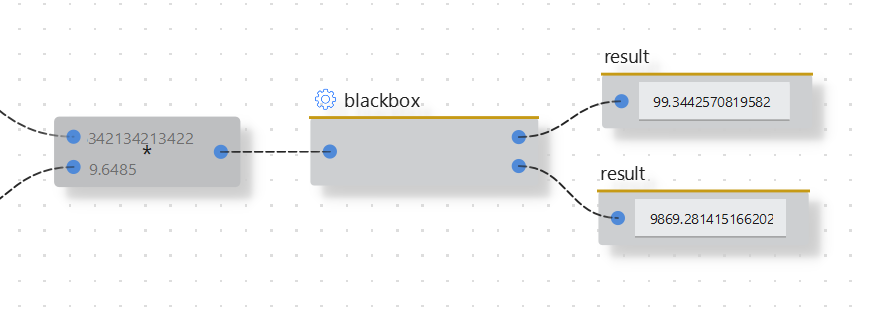
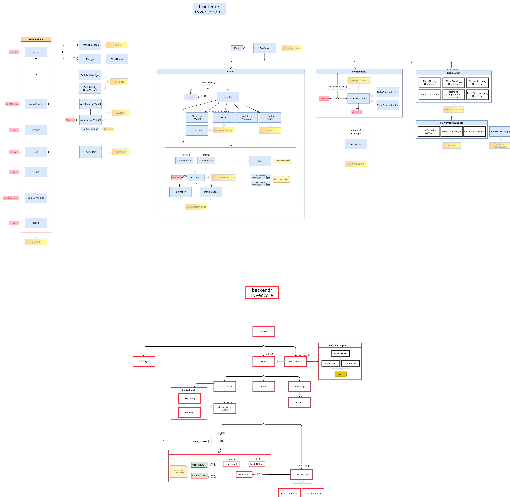

<p align="center">
  
</p>

`rvencore-qt` is a library for building flow-based visual scripting editors for Python with Qt. It comes from the [Ryven](https://github.com/leon-thomm/Ryven) project and will be the foundation for future Ryven versions, amongst other specialized editors. With ryvencore-qt you can create Ryven-like editors to optimize for a specific domain. Technically, `ryvencore-qt` provides a Qt-based frontend for what is now referred to as `ryvencore`. However, `ryvencore` itself is currently still included in this repository until the API is solid enough to give it its own public repo. `ryvencore` might be the base for implementing other frontends in the future.

### Installation

```
pip install ryvencore-qt
```

or from sources
```
git clone https://github.com/leon-thomm/ryvencore-qt
cd ryvencore-qt
python setup.py install
```

### Dependencies

`ryvencore-qt` currently uses [QtPy](https://github.com/spyder-ide/qtpy), which is a wrapper for Qt enabling you to choose between different bindings. *(However, due to some really bad inheritance restrictions in PyQt5, you cannot run  `ryvencore-qt` with PyQt5. I plan to use QtPy to enable seamless switching between PySide2 and PySide6.)*

Saved flows can be deployed directly on the backend (`ryvencore`) which does not have a single dependency so far!

### Features

#### load & save  
All serialization and loading of projects. Data is stored using `json`, and for some parts `pickle`.
```python
project: dict = my_session.serialize()
with open(filepath, 'w') as f:
    f.write(json.dumps(project))
```

#### simple nodes system  
All information of a node is part of its class. A minimal node definition can be as simple as this

```python
import ryvencore_qt as rc

class PrintNode(rc.Node):
    """Prints your data."""

    title = 'Print'
    init_inputs = [
        rc.NodeInputBP()
    ]
    color = '#A9D5EF'

    def update_event(self, inp=-1):
        print(self.input(0))
```
see also example below.

#### dynamic nodes registration mechanism  
You can register and unregister nodes at any time. Registered nodes can be placed in a flow.
```python
my_session.register_nodes( [ <your_nodes> ] )
```

#### macros / subgraphs  
You can define *macros* which have their own flow plus input and output node, which get registered as nodes themselves, just like this


Macros are like normal scripts plus input and output node


#### right click operations system for nodes  
which can be edited through the API at any time
```python
self.actions[f'remove input {i}'] = {
    'method': self.rem_input,
    'data': i,
}

# with some method...
def rem_input(self, index):
    self.delete_input(index)
    del self.actions[f'remove input {len(self.inputs)}']
```

#### Qt widgets  
You can add custom QWidgets for your nodes.

```python
class MyNode(rc.Node):
    main_widget_class = MyNodeMainWidget
    main_widget_pos = 'below ports'  # alternatively 'between ports'
    # ...
```

#### many different modifiable themes  
See [Features](https://leon-thomm.github.io/ryvencore-qt/features/).

#### exec flow support  
While data flows should be the most common use case, exec flows (like [UnrealEngine BluePrints](https://docs.unrealengine.com/4.26/en-US/ProgrammingAndScripting/Blueprints/)) are also supported.

#### stylus support for adding handwritten notes  


#### rendering flow images  

#### logging support  
```python
import logging

class MyNode(rc.Node):
    def __init__(self, params):
        super().__init__(params)

        self.my_logger = self.new_logger(title='nice log')
    
    def update_event(self, inp=-1):
        self.my_logger.log(logging.INFO, 'updated!')
```

#### variables system  
with an update mechanism to build nodes that automatically adapt to change of variables

```python
import logging
class MyNode(rc.Node):
    # ...
    def __init__(self, params):
        super().__init__(params)
        self.my_logger = self.new_log(title='nice log')
        # assuming a 'messages' var had been created in the flow's script
        self.register_var_receiver(name='messages', method=self.new_msg)
    
    def new_msg(self, msgs: list):
        self.my_logger.log(logging.INFO, f'received msg: {msgs[-1]}')
```

#### threading compatibility  
All communication between frontend (`ryvencore-qt`) and backend (`ryvencore`) is based on Qt signals. Therefore, there exists rudimentary threading compatibility, i.e. you can keep your session object in a separate thread to improve concurrency and prevent the backend from being slown down signicantly by the frontend, and all changes you perform directly on the backend are automatically noticed by the frontend. While this is currently extremely experimental and far from production ready, it opens the door to the world of realtime data processing and first successful tests have been made.

### Usage

``` python
import sys
import os
from random import random

os.environ['QT_API'] = 'pyside2'  # tells qtpy to use PySide2
import ryvencore_qt as rc
from qtpy.QtWidgets import QMainWindow, QApplication


class PrintNode(rc.Node):
    """Prints your data"""

    # all basic properties
    title = 'Print'
    init_inputs = [
        rc.NodeInputBP()
    ]
    init_outputs = []
    color = '#A9D5EF'

    # see API doc for a full list of properties

    # we could also skip the constructor here
    def __init__(self, params):
        super().__init__(params)

    def update_event(self, inp=-1):
        data = self.input(0)  # get data from the first input
        print(data)


class RandNode(rc.Node):
    """Generates random float"""

    title = 'Rand'
    init_inputs = [
        rc.NodeInputBP(dtype=rc.dtypes.Float(default=1.0, bounds=(0, 100)))
    ]
    init_outputs = [
        rc.NodeOutputBP()
    ]
    color = '#fcba03'

    def update_event(self, inp=-1):
        # random float between 0 and value at input
        val = random() * self.input(0)

        # setting the value of the first output
        self.set_output_val(0, val)


if __name__ == "__main__":

    # creating the application and a window
    app = QApplication()
    mw = QMainWindow()

    # creating the session, registering, creating script
    session = rc.Session()
    session.design.set_flow_theme(name='pure light')
    session.register_nodes([PrintNode, RandNode])
    script = session.create_script('hello world', flow_view_size=[800, 500])

    mw.setCentralWidget(session.flow_views[script])

    mw.show()
    sys.exit(app.exec_())
```

For a detailed overview visit the [docs page](https://leon-thomm.github.io/ryvencore-qt/). For a precise definition of the flows and features, see [Features](https://leon-thomm.github.io/ryvencore-qt/features/).

Cheers!

<!--

### Future Development

#### Qt Dependency

I am currently investigating on options for a more scalable replacement for the Qt signals which ryvencore's components use for communication in gui mode. Following suggestions of others, I'm especially looking at brokerless message queues like ZeroMQ, NNG right now. This might ultimately enable scaling ryvencore into the web with a JS based frontend in the browser. That's clearly far far future, but very exciting and a point where contributions by users with more experience with this would be very welcome.

### Contributing

Due to my study, I myself will not be able to work on this a lot during the next months. I did my best to provide an internal structure that is a good foundation for further development. For discussing general ideas and suggestions, notice the *Discussions* section. I'd be very happy to see people contribute.

-->

### Development

To give a quick overview over the most important class relations, see the below class diagram. The DrawIO diagram file is in the repository.


